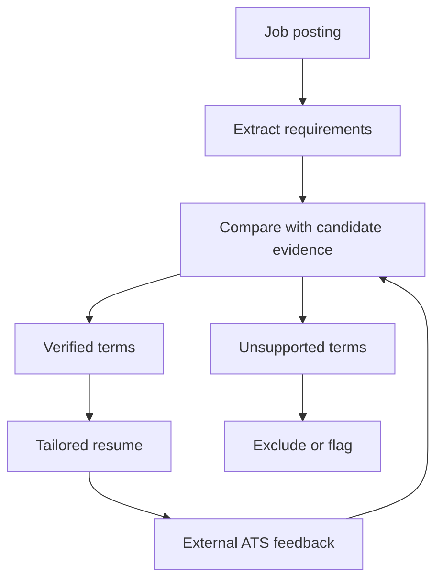

# Career Command Center

**A local-first career workflow application that turns job discovery, ATS analysis, resume tailoring, and application tracking into one evidence-based system.**

> The working application contains private candidate data, local configuration, and credentials, so the production source/data are not published here. This page documents the engineering work and validated behavior without exposing personal application records or secrets.

## The Problem

A serious job search creates repetitive work:

- finding current openings
- checking whether postings are still active
- comparing requirements with real experience
- tailoring a resume without inventing qualifications
- preserving project links and formatting
- tracking which resume went to which employer
- learning from ATS feedback
- following up without losing context

I had been doing those steps manually. Career Command Center grew out of the question:

**What if the entire workflow could become one application that gets better as I use it?**

## What It Does

Career Command Center currently combines:

- automatic job discovery
- live posting verification
- remote/Memphis and role-family filtering
- evidence-based opportunity ranking
- job-description extraction from URLs
- ATS keyword and title analysis
- candidate evidence/knowledge management
- employment-history precedence rules
- role-relevant resume tailoring
- DOCX and PDF generation
- public project-link preservation
- application tracking
- follow-up status
- resume version history
- external ATS feedback ingestion
- iterative resume improvement

## Evidence-First Resume Tailoring

A key design goal is to avoid keyword stuffing or invented experience.

The system maintains structured evidence from confirmed employment, projects, tools, accomplishments, and imported historical records. Requirements can then be classified against that evidence before a resume is generated.

Conceptually:

That loop allows the resume to become more targeted while keeping claims traceable to real evidence.

## Automatic Job Discovery

The discovery workflow can:

1. search for relevant roles
2. prioritize remote and Memphis-area opportunities
3. verify candidate URLs
4. reject closed/unavailable postings
5. deduplicate results
6. exclude jobs already present in application history
7. rank opportunities by evidence fit, location, seniority, interests, freshness, and application availability

The current search provider uses OpenAI's Responses API with web search behind a replaceable provider interface.

During live testing, the discovery workflow successfully returned and checked **14 current opportunities in one search run**.

## ATS Feedback Loop

Career Command Center stores external ATS feedback by job and resume version, including:

- overall match
- hard-skill gaps
- soft-skill gaps
- title match
- degree-match warnings
- keyword frequency variance
- general resume-quality feedback

One of the development regression cases improved from an initial **27% external job-match score to 81%**, while keeping unsupported requirements out of the resume.

That result became a regression target for later resume-generation changes rather than a one-off manual edit.

## Candidate Knowledge Vault

The Knowledge Vault separates facts from resume wording.

It stores sourced evidence such as:

- employment history
- project experience
- verified technical skills
- certifications
- accomplishments
- customer-service experience
- operational/logistics experience
- project URLs
- public/private project visibility

This lets the same real experience be expressed differently for a data role, customer-support role, supply-chain role, or software role without changing the underlying facts.

## Privacy and Safety

The application is deliberately local-first because job-search data can contain personal information.

Safeguards include:

- local SQLite storage
- credentials supplied outside source code
- API-key redaction in diagnostics
- private candidate data kept out of public portfolio material
- master resume protected from overwrite
- versioned generated resumes
- evidence classification before keyword insertion
- no automatic application submission
- rejection/flagging of unsupported requirements

## Technology

- Python
- SQLite
- OpenAI Responses API
- web search
- HTML/JSON-LD job-posting extraction
- DOCX generation
- PDF generation
- local web application UI
- automated regression tests
- structured evidence and employment-history models

## Job-Posting Extraction

The application attempts structured extraction first and then falls back to semantic/ATS-specific patterns.

Detection work includes common applicant-tracking platforms such as:

- Greenhouse
- Ashby
- Lever
- Workday
- Paycom

Extracted data is presented for review instead of silently being treated as correct.

## What I Learned Building It

Career Command Center forced several software problems to meet in one product:

- unreliable data from the public web
- third-party API integration
- local privacy requirements
- evidence provenance
- document generation
- external evaluation feedback
- versioning
- ranking
- error handling
- regression testing
- user workflow design

More importantly, it turned a repetitive problem in my own life into a tool I now actively use.

## Current Status

**Working local application in active development.**

A sanitized public source/demo release is planned after production candidate data, credentials, and local state are fully separated from synthetic demonstration data.

---

**Built by Zachary Maness**  
[GitHub](https://github.com/ZachPoli) · [LinkedIn](https://www.linkedin.com/in/zachary-maness-93051567/) · [Email](mailto:zachmaness.dev@gmail.com)
