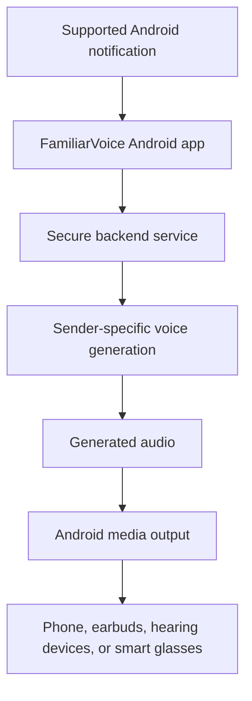

# FamiliarVoice

**An accessibility-focused Android prototype that makes incoming messages more personal by rendering them with sender-specific familiar voices.**

> Source code is intentionally maintained in a private repository while the project continues development. This page is a public engineering case study intended to demonstrate the problem, working MVP, technology, testing, and my role without publishing proprietary implementation details.

## Why I Built It

FamiliarVoice started with a personal accessibility problem. My father and grandmother are blind, and standard notification readouts typically use the same synthetic system voice for everyone.

I wanted to explore a different experience:

**What if a message from someone you love could sound like that person?**

That became FamiliarVoice—an Android prototype that can detect supported incoming messages, identify the sender, request sender-specific generated speech, and play the resulting audio through the active Android media route.

## Working MVP

I built and physically tested an end-to-end MVP using real Android devices and real SMS notifications.

The prototype has demonstrated:

- Android notification detection and message extraction
- sender-specific familiar-voice selection
- Android-to-backend communication
- generated speech returned to the Android device
- playback through the phone's active media output
- physical playback through Ray-Ban Meta glasses
- master speech enable/disable behavior
- persistent user settings
- filtering of unsupported/background notifications
- a privacy-conscious contact/voice-assignment workflow
- hosted backend operation and persistence testing

## High-Level Architecture

The current smart-glasses demonstration uses standard Android media routing rather than claiming a private or custom glasses API integration.

## Technology

### Android
- Kotlin
- Android SDK
- Jetpack Compose
- notification services
- local application state
- Android media playback

### Backend
- Python
- FastAPI
- structured request validation
- persistent mapping storage
- hosted backend testing

### Voice
- ElevenLabs text-to-speech
- sender-specific voice profiles
- custom/cloned voice testing

### Validation
- physical Android devices
- real Google Messages notifications
- hosted and local backend testing
- Ray-Ban Meta glasses
- automated backend tests

## What I Built

I took FamiliarVoice from concept to working prototype, including:

- product concept and accessibility use case
- Android notification workflow
- sender/message extraction
- Android/backend integration
- backend API and validation
- sender-to-voice mapping design
- generated-audio playback
- user controls and persistence
- contact/voice assignment workflow
- security and privacy hardening
- physical-device testing
- hosted deployment testing
- technical documentation and milestone planning

## Privacy and Product Thinking

Accessibility technology that handles messages and voice identity has real privacy implications. The prototype treats these as product requirements rather than afterthoughts.

Design considerations include:

- deliberate user action before contact-assignment operations
- limited information returned to the mobile client
- separation between mobile access and administrative capabilities
- private configuration kept outside source control
- clear consent expectations around represented/cloned voices
- recognition that the MVP is a prototype, not a claim of production-grade security

## Current Status

**Working end-to-end MVP. Active development continues in a private source repository.**

A short working demo has also been recorded. Public portfolio material is intentionally separated from the source implementation so the product can be demonstrated without publishing the complete codebase.

## What This Project Demonstrates

FamiliarVoice is more than a tutorial or class project. It demonstrates my ability to take a personal problem, define a product idea, integrate mobile and backend systems, work with third-party AI services, test on physical hardware, think through privacy constraints, document the system, and iterate toward a usable product.

---

**Built by Zachary Maness**  
[GitHub](https://github.com/ZachPoli) · [LinkedIn](https://www.linkedin.com/in/zachary-maness-93051567/) · [Email](mailto:zachmaness.dev@gmail.com)
